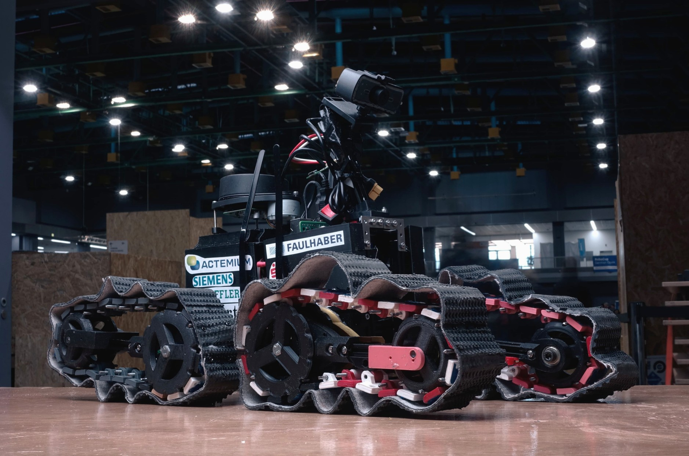

# Schäufele 

*The third robot by WLS robotics, masterful at stairs and ledges.*  
This repo and its [wiki](https://github.com/Bento-Robotics/Schaeufele/wiki) (are planned to) contain all information needed to rebuild Schäufele from scratch.

## [system-files](./system-files/README.md)
All system software changes made on Schäufele's computer.  
*networking, software installation*

## [container](./container/README.md)
The container system for robotics software.  
*ROS, fixing hangups*
